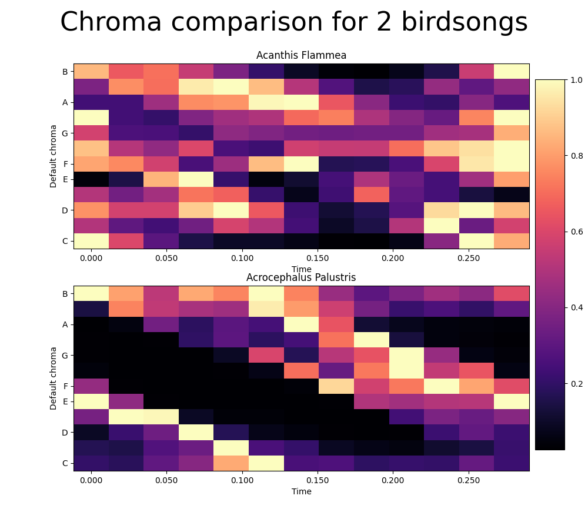

```{r setup, include=FALSE}
library(knitr)
library(ggplot2)
library(Dict)
library(ggpubr)
library(RWeka)
```

\newpage

# Acquiring the data
The CSV data is supplied by [Edoardo Ferrante on Kaggle](https://www.kaggle.com/datasets/fleanend/birds-songs-numeric-dataset).
This data was created using the Librosa package for Python. Librosa outputs the intensity of a certain tone at different time intervals from the provided sound file.
The original songs are gathered from [the Brittish Birdsong Dataset](https://www.kaggle.com/datasets/rtatman/british-birdsong-dataset) and processed using a Python script.
This script is available from the author and explains how the data was transformed from sound files to numeric data points, but this script has a specific shortcoming that will hinder our ability to visualize it.
It will be explained further in the data cleaning section, but in short it is an error that's made while sorting the data when the order is of absolute importance.

Each row in the dataset contains the chromogram data, spectral centroid data along with the genus and species name.
The structure for chromogram data is made up from values ranging from zero to one.
These values represent the intensity of different tones at a certain time in the audio fragment.
1 is loudest/clearest and 0 is silent/non-distinguishable.

| Name of datapoint | Description                     |
|-------------------|---------------------------------|
| chromogram_0_0    | Tone intensity for B at time 0  |
| chromogram_1_0    | Tone intensity for A# at time 0 |
| chromogram_2_0    | Tone intensity for A at time 0  |
| chromogram_3_0    | Tone intensity for G# at time 0 |
| chromogram_4_0    | Tone intensity for G at time 0  |
| chromogram_5_0    | Tone intensity for F# at time 0 |
| chromogram_6_0    | Tone intensity for F at time 0  |
| chromogram_7_0    | Tone intensity for E at time 0  |
| chromogram_8_0    | Tone intensity for D# at time 0 |
| chromogram_9_0    | Tone intensity for D at time 0  |
| chromogram_10_0   | Tone intensity for C# at time 0 |
| chromogram_11_0   | Tone intensity for C at time 0  |
| chromogram_0_1    | Tone intensity for B at time 1  |

Not all datapoints are represented in this table, because there are 13 timepoints which contain 12 tones each.
The data continues this format for the rest of the set.

There is also spectral centroid data, this is a measurement of the shape a waveform has at a certain point in time.
A higher value of a spectral centroid corresponds to more energy of the signal being concentrated within higher frequencies.

| Name of datapoint | Description                 |
|-------------------|-----------------------------|
| spec_centr_0      | Spectral centroid at time 0 |
| spec_centr_1      | Spectral centroid at time 1 |
| spec_centr_2      | Spectral centroid at time 2 |
| spec_centr_3      | Spectral centroid at time 3 |

Spectral centroid data could be used as an extra signature to classify the songs with.
The data continues this format for the rest of the set.

\newpage

# Data cleaning
First let's have a look at how Librosa normally outputs the chromogram data:


|               | 0       | 1       | 2       | 3       | 4       | 5       | 6       |
|---------------|---------|---------|---------|---------|---------|---------|---------|
| chromogram_0  | 0.68661 | 0.67378 | 0.65758 | 0.66149 | 0.68533 | 0.72239 | 0.76395 |
| chromogram_1  | 0.91368 | 0.88148 | 0.85024 | 0.82476 | 0.82282 | 0.83024 | 0.83908 |
| chromogram_2  | 0.98221 | 0.97060 | 0.95834 | 0.94729 | 0.94785 | 0.95189 | 0.95408 |
| chromogram_3  | 1.00000 | 1.00000 | 1.00000 | 1.00000 | 1.00000 | 1.00000 | 1.00000 |
| chromogram_4  | 0.96223 | 0.95790 | 0.95436 | 0.95403 | 0.94404 | 0.93285 | 0.91552 |
| chromogram_5  | 0.92098 | 0.89960 | 0.88007 | 0.86290 | 0.84262 | 0.82280 | 0.80381 |
| chromogram_6  | 0.87591 | 0.85544 | 0.83320 | 0.80870 | 0.78241 | 0.75819 | 0.73456 |
| chromogram_7  | 0.79397 | 0.79418 | 0.79848 | 0.80535 | 0.80741 | 0.80750 | 0.80913 |
| chromogram_8  | 0.62856 | 0.64859 | 0.68255 | 0.72441 | 0.76565 | 0.80078 | 0.82178 |
| chromogram_9  | 0.41881 | 0.41914 | 0.44003 | 0.48525 | 0.54615 | 0.61608 | 0.68581 |
| chromogram_10 | 0.36895 | 0.38299 | 0.40678 | 0.43114 | 0.45138 | 0.47237 | 0.52333 |
| chromogram_11 | 0.33855 | 0.34676 | 0.35929 | 0.37378 | 0.38602 | 0.39931 | 0.42756 |

As you can see, the output is a neat array containing the values of 12 different tones at different time intervals. This data is sorted and can be read by Librosa.

Now onto the issue; the provided dataset contains this data in a stacked order, so each sample only takes up one row.
This is a good idea, but due to sorting by alphabetical order the original order is lost. The order is important because we are working with data over time.
This is not a problem if the trained model is only used on the provided test data, but we want the trained model to work in as many situations as possible and be able to visualize it with ease.

Here is a look at the provided data:

| id  | chromogram_0_0      | chromogram_0_1      | chromogram_0_10   | chromogram_0_11    |
|-----|---------------------|---------------------|-------------------|--------------------|
| 0   | 0.997943662321316   | 0.832392210770135   | 0.7653861625931   | 0.70427464132375   |
| 1   | 0.996254885931866   | 0.839119599044146   | 0.760416790506312 | 0.705141765139875  |
| 2   | 0.970810156116343   | 0.823539694937237   | 0.759508104372184 | 0.709057883677716  |
| 3   | 1                   | 0.855558393364941   | 0.752038009313116 | 0.710976936190937  |
| 4   | 1                   | 0.884304523555434   | 0.741884532311754 | 0.714775207828629  |
| 5   | 0.971867873978603   | 0.824311712155432   | 0.755293860709407 | 0.71448132195049   |
| 6   | 1                   | 0.835499361583387   | 0.751917158063063 | 0.717361992854453  |
| 7   | 0.978929855885584   | 0.827216718543843   | 0.751072631712318 | 0.718400862681119  |
| 8   | 1                   | 0.895339720206626   | 0.733409813021178 | 0.722747412968086  |
| 9   | 0.967651828343747   | 0.823697857901917   | 0.746005680687241 | 0.721194823494439  |
| 10  | 0.993699774531599   | 0.847257121555946   | 0.734368883301346 | 0.726420069139032  |
| 11  | 0.00947350497274455 | 0.00699383738737368 | 0.372026644035831 | 0.0516494292032762 |
| 12  | 0.00982270123521504 | 0.00712337798131429 | 0.371129653847745 | 0.051631441504244  |

Each row contains a stack of chromogram data in a non-sequential order. The end of the array also contains the species of the corresponding bird and some spectral centroid data.
These collumns need to be deleted since we want to predict using only the chromogram data.

\newpage


Figure 1 shows a comparison of the order of provided data and the ideal order the data should be sorted in.
The following script processes the provided data to the aforementioned format and deletes the unnecessary columns.

\newpage

```{python data, decorate=TRUE, results='hide', file='view.py', eval = FALSE}
```

\newpage



This figure shows the chroma signature comparison for 2 fragments of different bird-species songs.
It was created by transforming the input data to the correct format that is normally outputted by librosa, because the sound data is created using librosa.
The x-axis shows the time of the sound fragment, while the y-axis shows the intensity of different tones on the given time.

```{r}
chromogram_data_train <- read.csv('data/dataframe_train.csv', header = TRUE, sep = ',')
chromogram_data_test <- read.csv('data/dataframe_test.csv', header = TRUE, sep = ',')

colnames(chromogram_data_train)[1] <- "Species"
colnames(chromogram_data_test)[1] <- "Species"

```

\newpage

```{r}
# Function for transferring row data into data frames
index_data <- function (row_number) {
  temp <- data.frame()
  temp[1, 1:12] <- chromogram_data_train[row_number, 2:13]
  temp[2, 1:12] <- chromogram_data_train[row_number, 14:25]
  temp[3, 1:12] <- chromogram_data_train[row_number, 26:37]
  temp[4, 1:12] <- chromogram_data_train[row_number, 38:49]
  temp[5, 1:12] <- chromogram_data_train[row_number, 50:61]
  temp[6, 1:12] <- chromogram_data_train[row_number, 62:73]
  temp[7, 1:12] <- chromogram_data_train[row_number, 74:85]
  temp[8, 1:12] <- chromogram_data_train[row_number, 86:97]
  temp[9, 1:12] <- chromogram_data_train[row_number, 98:109]
  temp[10, 1:12] <- chromogram_data_train[row_number, 110:121]
  temp[11, 1:12] <- chromogram_data_train[row_number, 122:133]
  temp[12, 1:12] <- chromogram_data_train[row_number, 134:145]
  temp[13, 1:12] <- chromogram_data_train[row_number, 146:157]
  return(as.data.frame(temp))
}

# Dictionary for the different chromograms and their corresponding tones
tones <- Dict$new("chromogram_0_0" = "Tone intensity for B",
                  "chromogram_1_0" = "Tone intensity for A#",
                  "chromogram_2_0" = "Tone intensity for A",
                  "chromogram_3_0" = "Tone intensity for G#",
                  "chromogram_4_0" = "Tone intensity for G",
                  "chromogram_5_0" = "Tone intensity for F#",
                  "chromogram_6_0" = "Tone intensity for F",
                  "chromogram_7_0" = "Tone intensity for E",
                  "chromogram_8_0" = "Tone intensity for D#",
                  "chromogram_9_0" = "Tone intensity for D",
                  "chromogram_10_0" = "Tone intensity for C#",
                  "chromogram_11_0" = "Tone intensity for C")

flammea <-ggplot(data = index_data(1), aes(y = chromogram_0_0, x = 1:13)) +
              geom_line() +
              ylim(0,1) +
              ylab(tones["chromogram_0_0"]) +
              xlab("Time") +
              ggtitle(chromogram_data_train[1,1])

palustris <- ggplot(data = index_data(21), aes(y = chromogram_0_0, x = 1:13)) +
              geom_line() +
              ylim(0, 1) +
              ylab(tones["chromogram_0_0"]) +
              xlab("Time") +
              ggtitle(chromogram_data_train[21,1])

ggarrange(flammea, palustris,
          ncol = 1, nrow = 2)
```

The figure above shows a significant difference in the tone intensity over time for 2 different bird species.

```{r}
write.arff(chromogram_data_train, file = "data/birdsong_train.arff")
write.arff(chromogram_data_test, file = "data/birdsong_test.arff")
```
