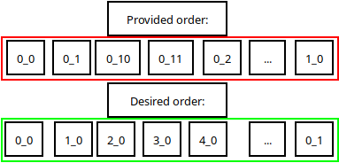

```{r setup, include=FALSE}
library(knitr)
library(reticulate)
reticulate::use_virtualenv("../Praktijkopdracht/venv")
```

# Data cleaning
The CSV data is supplied by [Edoardo Ferrante on Kaggle](https://www.kaggle.com/datasets/fleanend/birds-songs-numeric-dataset).
This data was created using the Librosa package for Python. Librosa outputs the intensity of a certain tone at different time intervals from the provided sound file.
There is a Python script available from the author that explains how the data was transformed from sound files to numeric data points, but this script has a specific shortcoming.

First let's have a look at how Librosa normally outputs the chromogram data:


|               | 0       | 1       | 2       | 3       | 4       | 5       | 6       |
|---------------|---------|---------|---------|---------|---------|---------|---------|
| chromogram_0  | 0.68661 | 0.67378 | 0.65758 | 0.66149 | 0.68533 | 0.72239 | 0.76395 |
| chromogram_1  | 0.91368 | 0.88148 | 0.85024 | 0.82476 | 0.82282 | 0.83024 | 0.83908 |
| chromogram_2  | 0.98221 | 0.97060 | 0.95834 | 0.94729 | 0.94785 | 0.95189 | 0.95408 |
| chromogram_3  | 1.00000 | 1.00000 | 1.00000 | 1.00000 | 1.00000 | 1.00000 | 1.00000 |
| chromogram_4  | 0.96223 | 0.95790 | 0.95436 | 0.95403 | 0.94404 | 0.93285 | 0.91552 |
| chromogram_5  | 0.92098 | 0.89960 | 0.88007 | 0.86290 | 0.84262 | 0.82280 | 0.80381 |
| chromogram_6  | 0.87591 | 0.85544 | 0.83320 | 0.80870 | 0.78241 | 0.75819 | 0.73456 |
| chromogram_7  | 0.79397 | 0.79418 | 0.79848 | 0.80535 | 0.80741 | 0.80750 | 0.80913 |
| chromogram_8  | 0.62856 | 0.64859 | 0.68255 | 0.72441 | 0.76565 | 0.80078 | 0.82178 |
| chromogram_9  | 0.41881 | 0.41914 | 0.44003 | 0.48525 | 0.54615 | 0.61608 | 0.68581 |
| chromogram_10 | 0.36895 | 0.38299 | 0.40678 | 0.43114 | 0.45138 | 0.47237 | 0.52333 |
| chromogram_11 | 0.33855 | 0.34676 | 0.35929 | 0.37378 | 0.38602 | 0.39931 | 0.42756 |

As you can see, the output is a neat array containing the values of 12 different tones at different time intervals. This data is sorted and can be read by Librosa.

Now onto the issue; the provided dataset contains this data in a stacked order, so each sample only takes up one row.
This is a good idea, but due to sorting by alphabetical order the original order is lost. The order is important because we are working with data over time.
This is not a problem if the trained model is only used on the provided test data, but we want the trained model to work in as many situations as possible.

Here is a look at the provided data:

| id  | chromogram_0_0      | chromogram_0_1      | chromogram_0_10   | chromogram_0_11    |
|-----|---------------------|---------------------|-------------------|--------------------|
| 0   | 0.997943662321316   | 0.832392210770135   | 0.7653861625931   | 0.70427464132375   |
| 1   | 0.996254885931866   | 0.839119599044146   | 0.760416790506312 | 0.705141765139875  |
| 2   | 0.970810156116343   | 0.823539694937237   | 0.759508104372184 | 0.709057883677716  |
| 3   | 1                   | 0.855558393364941   | 0.752038009313116 | 0.710976936190937  |
| 4   | 1                   | 0.884304523555434   | 0.741884532311754 | 0.714775207828629  |
| 5   | 0.971867873978603   | 0.824311712155432   | 0.755293860709407 | 0.71448132195049   |
| 6   | 1                   | 0.835499361583387   | 0.751917158063063 | 0.717361992854453  |
| 7   | 0.978929855885584   | 0.827216718543843   | 0.751072631712318 | 0.718400862681119  |
| 8   | 1                   | 0.895339720206626   | 0.733409813021178 | 0.722747412968086  |
| 9   | 0.967651828343747   | 0.823697857901917   | 0.746005680687241 | 0.721194823494439  |
| 10  | 0.993699774531599   | 0.847257121555946   | 0.734368883301346 | 0.726420069139032  |
| 11  | 0.00947350497274455 | 0.00699383738737368 | 0.372026644035831 | 0.0516494292032762 |
| 12  | 0.00982270123521504 | 0.00712337798131429 | 0.371129653847745 | 0.051631441504244  |

Each row contains a stack of chromogram data in a non-sequential order. The end of the array also contains the species of the corresponding bird and some spectral centroid data.
These collumns need to be deleted since we want to predict using only the chromogram data.




Figure 1 shows a comparison of the order of provided data and the ideal order the data should be sorted in.
The following script processes the provided data to the aforementioned format and deletes the unnecessary columns.

```{python data, decorate=TRUE, results='hide', file='view.py'}
```
This figure shows the chroma signature comparison for 2 fragments of different bird-species songs.
It was created by transforming the input data to the correct format that is normally outputted by librosa, because the sound data is created using librosa.
The x-axis shows the time of the sound fragment, while the y-axis shows the intensity of different tones on the given time.

```{r}
chromogram_data <- read.csv('data/dataframe_train.csv', header = TRUE, sep = ',')
```
